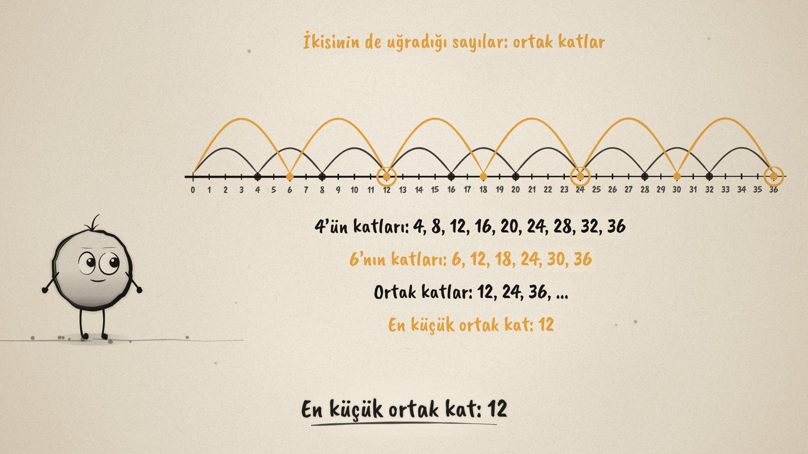
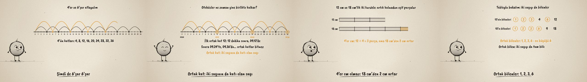

# Nerede Buluşurlar? · Common Multiples and Common Divisors

**▶ Tarayıcıda izleyin / Watch in the browser:** https://hakanatas.github.io/nerede-bulusurlar/ 
**⬇ MP4 + altyazılar / MP4 + subtitles:** [Releases](https://github.com/hakanatas/nerede-bulusurlar/releases) 
**✎ Kullanılan istem / The prompt behind it:** [PROMPT.md](PROMPT.md) 
**🎞 Bütün filmler / All films:** [Nokta'nın Filmleri](https://hakanatas.github.io/nokta-filmleri/?sinif=6)

> **TR —** 6. sınıf matematik "Sayılar ve Nicelikler" temasındaki MAT.6.1.4 öğrenme çıktısı için hazırlanmış, tamamen JavaScript ile çizilen 92 saniyelik mürekkep animasyonu. Aynı duraktan biri 4, diğeri 6 dakikada bir kalkan iki otobüs: sayı doğrusunda 4'er ve 6'şar atlamalar 12, 24 ve 36'da buluşuyor. Bunlar ortak katlar; en küçüğü 12, yani otobüsler 09.12'de yine birlikte kalkıyor. Sonra 12 cm ve 18 cm'lik iki kurdele artık kalmadan eşit parçalara kesiliyor: 2 cm olur, 4 cm olmaz (18 cm'den 2 cm artar), 6 cm olur. Bir tabloda 12'nin ve 18'in bölenleri yan yana yazılıp ortak bölenler (1, 2, 3, 6) işaretleniyor. Son problemde 24 kalem ve 36 silgi en çok 12 pakete ayrılıyor. Ortak katlar sonsuz, ortak bölenler sınırlı. Altyazılar Türkçe, İngilizce ya da ikisi birlikte seçilebilir.

A 92-second ink animation for **6th-grade maths**, drawn entirely with JavaScript on an HTML5 canvas. Nokta, the ink character from [The Learning Ink](https://github.com/hakanatas/the-learning-ink), is the guide again. The outcome asks for drawings, tables and number lines, so the film uses all three: a number line for common multiples, ribbons (a drawing) and a divisor table for common divisors. The divisor lists in the last problem are computed (`divisors` in `src/draw/film.js`).

## Learning outcome

MEB, Türkiye Yüzyılı Maarif Modeli, Ortaokul Matematik, 6th grade, "Sayılar ve Nicelikler" theme:

**MAT.6.1.4. Günlük hayat problemleri ya da matematiksel durumlar üzerinden ortak kat ve ortak böleni yorumlayabilme**
- a) Problemlerde ya da matematiksel durumlarda verilen iki sayının ortak katlarını ve ortak bölenlerini inceler.
- b) İncelediği ortak kat veya ortak bölen ilişkilerini çizim, tablo ve sayı doğrusu gibi matematiksel temsillerle ifade eder.
- c) İki sayının ortak katlarını ve ortak bölenlerini kendi ifadelerini kullanarak açıklar.

## Scenes

| # | Time | Scene | What happens | Outcome |
|---|---|---|---|---|
| 1 | 0–10 s | İki otobüs | One bus leaves every 4 minutes, the other every 6; both left at 09.00. | a |
| 2 | 10–32 s | Ortak katlar | Jumps of 4 and of 6 on a number line meet at 12, 24, 36. The smallest common multiple is 12. | a, b |
| 3 | 32–44 s | Otobüsler | The number line as minutes: together again at 09.12, 09.24, 09.36. A common multiple is a multiple of both numbers. | a, c |
| 4 | 44–66 s | Ortak bölenler | Ribbons of 12 cm and 18 cm cut every 2, 4 and 6 cm; 4 leaves 2 cm over. A divisor table rings 1, 2, 3, 6. | a, b, c |
| 5 | 66–80 s | Bir problem daha | 24 pens and 36 erasers into equal packs: at most 12 packs, 2 pens and 3 erasers each. Common multiples go on, common divisors are few. | a, c |
| 6 | 80–92 s | Aklında kalsın | What a common multiple and a common divisor are, with the two examples. | c |

## Running it

- **Preview:** double-click `index.html` (it works offline).
- **MP4:** run `npm install` once, then `npm run export -- --format=horizontal --captions=tr`.
- **Subtitles and narration:** `npm run srt` writes `out/captions_*.srt` and `narration_notes.txt`.
- **Editing:**
  - Caption text, timings and narration notes: `captions.js`
  - Everything on screen is drawn by `LI.world(t)` in `scenes/scene1.js` (jumps, ribbons and their cut phases, the divisor table, the problem); the other scenes only set the camera.
  - The number line, jumps, ribbons and Nokta's poses: `src/draw/film.js`; layout for 16:9 and 9:16: `src/draw/kd.js`

It uses the same engine as The Learning Ink: `renderFrame(t)` as a pure function of time, seeded randomness, and frame-by-frame export.
